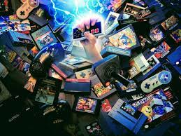
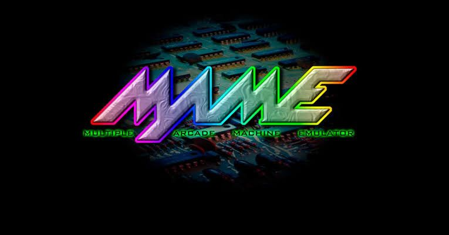

# Proyecto-PaginasWeb
<!DOCTYPE html>
<html>
<head>
	<title>Videojuegos</title>
	<link rel="stylesheet" type="text/css" href="Color.css">
</head>
<body background="Imagenes/Fondo 3.jpg">
	
 
		<header>
			

			<h2 class="titulo"> Paginas Web </h2>
			
 EXPLICACION DE LOS VIDEOJUEGOS

			

			<header>
		<nav class="navegacion">
			<ul class="menu">
				<li><a href="Proyecto videojuegos.html">Inicio</a></li>
				<li><a href="https://hdnh.es/historia-resumida-videojuegos">Historia</a></li>
				<li><a href="https://xtremehw.com/5-plataformas-de-juegos-para-pc-gamers/">Plataformas</a>
					<ul class="submenu">
						<li><a href="https://store.playstation.com/es-mx/category/35027334-375e-423b-b500-0d4d85eff784/1?gclid=Cj0KCQjwna2FBhDPARIsACAEc_Xk31O30NMnAFzUQc6WJ-qxSjCUibLcOkLj-CS_RKRNo85_CU2tYpcaAoiAEALw_wcB">Play Station Store</a></li>
						<li><a href="https://www.xbox.com/es-MX/microsoft-store">XBOX Store</a></li>
						<li><a href="https://store.steampowered.com/app/1538570/Patron/?gclid=Cj0KCQjwna2FBhDPARIsACAEc_WiwXTringzUWdSt_MhaQEd7Mz8x-NL6ghb6x9bKeY6Qh1DbKDQkdEaAkDPEALw_wcB">Steam Store</a></li>
					</ul>	
				</li>
				<li><a href="#">Contacto</a></li>
			</ul>
		</nav>
	</header>
		<section id="slide">
			
		</section>

	<section id="categorias">
	<section class="uno">
	
	<h2>VIDEOJUEGOS</h2>
	

				Un videojuego es una aplicación interactiva orientada al entretenimiento que, a través de ciertos mandos o controles, permite simular experiencias en la pantalla de un televisor, una computadora u otro dispositivo electrónico.
	<a href="https://blogs.ceibal.edu.uy/formacion/faqs/que-es-un-videojuego/" class="leer-mas">Leer Mas...</a> 
			

		</section>
		<section class="uno">
			
			<h2>Frases de videojuegos</h2>
			

				-Lo siento Mario, pero la princesa está en otro castillo. Super Mario Bros.«Todos tomamos decisiones en la vida, pero al final nuestras decisiones nos hacen a nosotros.» – Andrew Ryan, Bioshock
			

			<a href="https://www.informacion.es/vida-y-estilo/tecnologia/videojuegos/2019/09/08/frases-videojuegos-pasaran-historia-5292055.html" class="leer-mas">Leer Mas...</a> 
	</section>
	<section class="uno">
			
			<h2>Recomendaciones de videojuegos</h2>
			

				No pueden jugar con sus amigos y muchos padres relajan las restricciones a sabiendas de que en muchos casos la partida al videojuego de turno es su vía de escape frente a la monótona rutina en casa.
			

			<a href="https://www.informacion.es/vida-y-estilo/tecnologia/videojuegos/2019/09/08/frases-videojuegos-pasaran-historia-5292055.html" class="leer-mas">Leer Mas...</a> 
			
	</section>
</section>
	<section class="uno">
			
			<h2>Emulador Project64 DESCARGARBLE</h2>
			

				Project64 es un emulador de Nintendo 64 escrito en C, diseñado para la plataforma Windows que empezó a comercializarse el 26 de mayo de 2001. Este software utiliza un sistema mediante plugins permitiendo que grupos de terceros empleen su propio software para la implementación de componentes específicos
			

			<a href="https://project64.softonic.com" class="leer-mas">Leer Mas...</a> 
		</section>
		<section class="uno">
			
			<h2>SEGA MEGA DRIVE DESCARGARBLE</h2>
			

				Sega Mega Drive se pueden encontrar muy fácilmente en Internet. Estas pueden tener dos formatos, o bien pueden estar en .md, o en .bin, dependiendo del tipo de volcado que hayan tenido el juego original. Además, también podemos encontrar juegos en formato.
			

			<a href="https://gensoid.uptodown.com/android" class="leer-mas">Leer Mas...</a> 
		</section>
		<section class="uno">
			
			<h2>Emulador MAME DESCARGARBLE</h2>
			

				MAME es un emulador multipropósito de máquinas recreativas, libre y de código abierto, que replica el hardware de estos equipos para su funcionamiento en computadoras domésticas y otros tipos de dispositivos.
			

			<a href="https://gensoid.uptodown.com/android" class="leer-mas">Leer Mas...</a> 
		</section>
		<section class="uno">
			
			<h2>Free Roms</h2>
			

				
			<a href="https://www.freeroms.com" class="leer-mas">Leer Mas...</a> 
		</section>
	

	

		<ul class="slide">
			<li id="slider1">
				
			</li>
			<li id="slider2">
				
			</li>
			<li id="slider3">
				
			</li>
			<li id="slider4">
				
			</li>
		</ul>
		<ul class="menu2">
			<li>
				<a href="#slider1">1</a>
			</li>
			<li>
				<a href="#slider2">2</a>
			</li>
			<li>
				<a href="#slider3">3</a>
			</li>
			<li>
				<a href="#slider4">4</a>
			</li>
		</ul>
	

</body>
</html>

<!DOCTYPE html>
<html lang="es">
<head>
	<meta charset="UTF-8">
	<title></title> 
	<meta name="viewport" content="width=device-width, user-scalable=yes, initial-scale=1.0, maximum-scale=3.0, minimum-scale=1.0">
 <link rel="stylesheet" href="https://use.fontawesome.com/releases/v5.6.3/css/all.css" >
	<link rel="stylesheet" href="Color.css">
	

</head>  
<body>
 <form class="formulario">
    
    <h1>Registrate</h1>
     

     
     

         <i class="fas fa-user icon"></i>
         <input type="text" placeholder="Nombre Completo">
         
         

         
         

         <i class="fas fa-envelope icon"></i>
         <input type="text" placeholder="Correo Electronico">
         
         

         
         

        <i class="fas fa-key icon"></i>
         <input type="password" placeholder="Contraseña">
         
         

         <input type="submit" value="Registrate" class="button">
         
Al registrarte, aceptas nuestras Condiciones de uso y Política de privacidad.

         
¿Ya tienes una cuenta?<a class="link" href="loginvista.html">Iniciar Sesion</a>

     

    </form>
</body>
</html>
